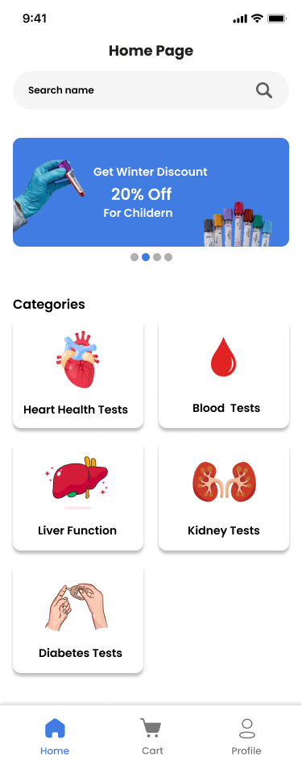

# **LabLink - Lab Test Booking App**
LabourLink is a mobile app that allows users to conveniently book lab tests and manage home sample collection services.
[](https://github.com/emanfaisal333/LabLink)

## 📖 **About The Project**

The **LabLink** app aims to simplify healthcare access by allowing users to **book lab tests from home** without visiting clinics.  
Users can browse tests, schedule home sampling at convenient times, and track their bookings in real-time.  

The objective is to create a **fast, secure, and user-friendly mobile app** that modernizes how patients manage medical test bookings.

---

## **Features**

- **User Authentication** – Sign up and log in securely.  
- **Browse Tests** – View a catalog of available lab tests.  
- **Cart System** – Add multiple tests before booking.  
- **Home Sampling** – Select desired date, time, and address.  
- **Booking Management** – View and manage existing bookings.  
- **Admin Panel** – Manage users, tests, and appointments.  

---

## 🛠️ **Built With**

  
  


---

## **How to Run the Project**

## 🚀 Getting Started

To get a local copy of the Lab Link project up and running on your machine, follow these steps.

### Prerequisites

- *Node.js and npm* must be installed. Download from [https://nodejs.org/](https://nodejs.org/)
- *Expo Go app* installed on your mobile device:
  - [Android (Play Store)](https://play.google.com/store/apps/details?id=host.exp.exponent)
  - [iOS (App Store)](https://apps.apple.com/app/expo-go/id982107779)

### **Clone the repository**
```bash
git clone https://github.com/emanfaisal333/LabLink.git
```
---
Navigate to the project folder
```bash
cd LabLink
```
Install dependencies
```bash
npm install
```
Run the development server
```bash
npx expo start
```
